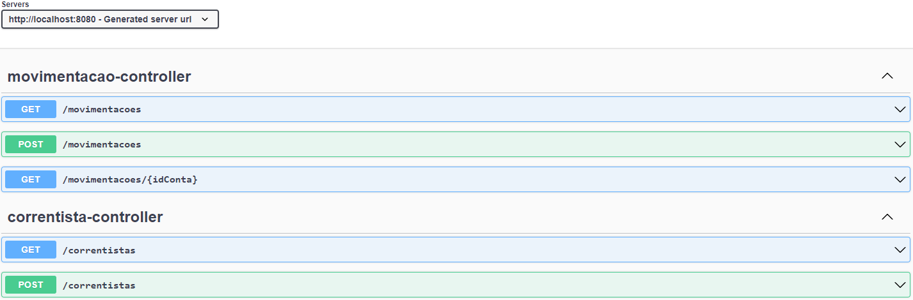

<h1 align="center">SANTANDER DEV WEEK</h1>
<h2 align="center">API REST</h2>

 

• <a href="#Objetivo">Objetivo</a>
 • <a href="#Preparação">Preparação</a> 
 • <a href="#Tecnologias">Tecnologias</a>
 • <a href="#Funcionalidades">Funcionalidades</a>

## Objetivo 
Abstrair o domínio bancário em uma AIP REST capas de cadastrar novos usuários e acompanhar suas movimentações financeiras.

 

## Preparação

Será necessario ter instalado o [Java versão 8](https://www.oracle.com/br/java/technologies/javase/jdk11-archive-downloads.html) ou superior.

Além disto você precisara de uma IDE, como por exemplo o [Eclipse](https://www.eclipse.org/downloads/) ou [NetBeans](https://netbeans.apache.org/download/index.html) e também o banco de dados [Postgres](https://www.enterprisedb.com/downloads/postgres-postgresql-downloads) para rodar localmente.

 

## Tecnologias

Foram utilizadas as seguintes tecnologias:

- <b>Java</b>
- <b>Eclipse</b>
- <b>Spring Boot</b>
- <b>Swagger</b>
- <b>Hibernate</b>
- <b>PostgresSQL</b>

 

##  Funcionalidades do projeto

`GET /movimentacoes`: Retorna os dados das movimentações realizadas pelos usuários.

`POST /movimentacoes`: Salva no bancos de dados as movimentações realizadas pelos usuários.

`GET /correntistas`: Retorna os dados dos usuários cadastardos no banco de dados.

`POST /correntistas`: Cadastra novos usuários no banco de dados.

